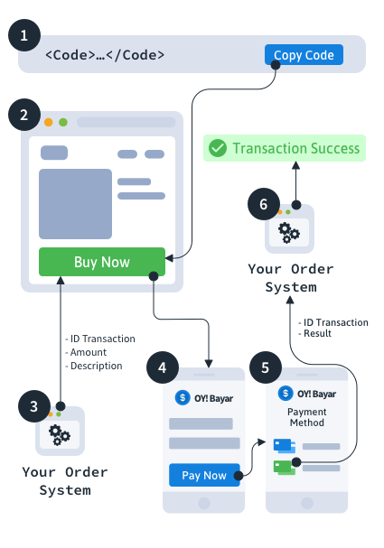

# Introduction

OY! API service enables business owners like you to receive payments from customers, either **from your Application** or independently **by sending your Payment URL to your customers**.

With quick and easy integration, your business can start accepting payments on Day 1 after registration.

OY! Bayar supports multiple payment methods, including *Direct Debit*, *Credit Cards*, and *Bank Virtual Accounts*.

# Quick Integration

> To open OY! Bayar webview, use following code from your platform:

```javascript
window.open("https://pay.oyindonesia.com/username", "_blank"); 
```

```java
Intent intent = new Intent(context, YourWebviewActivity.class);
intent.putExtra("url", "https://pay.oyindonesia.com/username")
startActivity(intent)
```

```swift
let controller = OyWebViewController()
controller.url = "https://pay.oyindonesia.com/username"
let navigationController = UINavigationController(rootViewController: controller)
present(navigationController, animated: true, completion: nil)
```

> Make sure to replace `username` with your account username, given on the email.

### Get Payment URL for your business


1. Register for a unique payment URL here: [https://business.oyindonesia.com/oybayar](https://www.oyindonesia.com/oybayar)
2. You will receive an email containing a unique payment URL for *trial version* of the checkout page. From here, you can immediately start the integration.

<aside class="warning">
Limitation of OY! Bayar (Trial Version)
</aside>

Payment URL for the *trial version* will have several limitations, including:

* Amount of payment is locked to Rp 10.000
* It contains BIG watermark mentioning unverified account (note: you are not supposed to use this for production)
* You don't get API Callback for payment result. However, you will notice that money will be sent to your bank account in real time

You can upgrade to OY! business partner to remove above limitations, by sending reply to the email that you receive. Our team will response your email quickly.

### How Does It Work?


1. **Put the logic of opening webview** on your app button, so that whenever buyer clicks on "Payment" button, it will open OY! Bayar checkout webview
2. You implement your own **Product details page**
3. You implement your **Order System to create transactionId** for buyers to checkout their order
4. Your App/Web **opens OY! Bayar** Checkout page with additional parameters required
5. Buyer pays using any of *Direct Debit*, *Credit Cards*, or *Bank Virtual Accounts*.
6. You **receive money on your receiving account** and OY! will **send Payment status Callback** to your end point (note: Only available for non-trial account)

# OY! Bayar Webview

## Request With Parameters

```javascript
let params = 'open=true';
params += (txid !== null) ? '&txid='+txid : '';
params += (amount !== null) ? '&amount='+amount : '';
params += (description !== null) ? '&description='+encodeURIComponent(description) : '';
params += (show_contact !== null) ? '&show_contact='+show_contact : '';
params += (show_account !== null) ? '&show_account='+show_account : '';
params += (send_notif !== null) ? '&send_notif='+send_notif : '';

window.open("https://pay.oyindonesia.com/username?" + params, "_blank"); 
```

Open this URL as webview to open OY! Bayar Checkout page, optionally with additional parameters.

### Open Webview

`GET http://pay.oyindonesia.com/username`

<aside class="success">
Remember — Make sure to replace `username` with your account username, given on the email.
</aside>

### Query Parameters

Parameter | Default | Description
--------- | ------- | -----------
txid | not set | If set to specific ID, OY! will echo back the transactionID label via the Payment Result Callback (parameter name `txid`)
amount | not set | If set to certain amount, will lock the amount of payment that Buyer can pay. Otherwise, Buyer needs to input the amount
description | not set | If set, description text will be shown the main page of OY! Bayar webview. Otherwise, it will show blank description
show_contact | true | If set to true, OY! Bayar webview will show Contact Form asking details of the Buyer
show_account | true | If set to true, OY! Bayar webview will show your bank account number
send_notif | true | Whether OY! should send payment notification to the Buyer via SMS/Push Notif
enable_payment_cc | false | Whether OY! should enable payment using Credit Card
enable_payment_va | false | Whether OY! should enable payment using Bank Virtual Accounts

## Payment Result Callback

```json
{
  "txid": "partner000001",
  "oy_txid": "1234567",
  "nominal": 10000,
  "name": "Joko Widodo",
  "phone_number": "+6281111111",
  "note": "Mohon dikirim segera",
  "result": "success"
}
```

Non-trial Account can register specific end point URL (web hook) to receive callback whenever payment occurs.

<aside class="warning">You need to register an end point URL to receive this callback. Note that Trial Account would not get access to this feature</aside>

### Callback Parameters

The data on the callback will be sent using JSON format via POST data to your web hook.
Check here for example: [example](/?json#payment-result-callback)

Parameter | Description
--------- | -----------
txid | (Optional) TransactionID which partner set on the initial OY! Bayar URL
oy_txid | Internal TransactionID from OY! system
nominal | Amount of payment by the Buyer
name | Name of Buyer
phone_number | Phone Number of Buyer
note | (Optional) This is note from the Buyer
result | Payment Status of Buyer. Can be either "success" or "failed"
